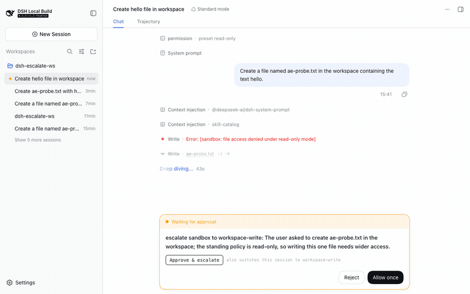

# dsh-almazom-approve-escalate

One click on the DSH web approval card: **approve the pending request and switch the live session to full access** (`danger-full-access`: sandbox off, no further approval prompts) — plus a `/yolo` composer command that switches the permission preset without a pending request.

Isolated third-party plugin. No harness core changes, no telemetry, no secrets.



## What you get

The approval card ("Waiting for approval") grows one extra action above the shipped Reject / Allow once row:

- **Approve & full access** — dispatches `/permission danger-full-access` on the live session (the same command the shipped `/permission` picker uses) and then answers the pending request as *Allow once*. A warning line spells out that future approval prompts are disabled.
- **/yolo** — composer command (slash menu) that switches the session to full access without a pending request; the status chip flips to Full access.
- Both shipped buttons keep working; the plugin only composes two manual actions into one click. If the host lacks the `/permission` command, the button says so instead of answering blind.

## Install

```sh
dsh plugin --profile web add dsh-almazom-approve-escalate
```

(or from git: `dsh plugin --profile web add git+https://github.com/almazom/dsh-almazom-approve-escalate.git`)

After installing, hard-refresh the browser so the client bundle picks up the new rev.

Then restart the web app (`dsh web` / your service manager) and hard-refresh the browser.

## Configure

Override the preset or the label in the profile patch layer (`~/.dsh/profiles/web/cordis.patch.yml` or `$DSH_HOME/cordis.patch.yml`):

```yaml
- insert:
    - id: almazom-approve-escalate
      name: 'dsh-almazom-approve-escalate'
      config:
        preset: 'workspace-write'   # any permission preset your host offers
        label: 'Approve & escalate'
```

## Rollback

```sh
dsh plugin --profile web remove dsh-almazom-approve-escalate
```

(or delete the `insert` row above). No host files besides the profile's own `node_modules` and patch layers are touched.

## Security & trust

- Plugins hold full host privileges — review the source before installing. It is two hand-written files: [`lib/index.js`](lib/index.js) (host: serves the config JSON above) and [`lib/client.js`](lib/client.js) (browser: the button).
- The client bundle uses the official plugin surfaces only: the documented `conversation.approval.detail` slot, the `slots`/`sessions` client services, and the live-session command API. It never touches the network beyond same-origin config/config fetches; there is no outbound traffic.
- The escalation reuses the operator-auditable `/permission` command path — the switch is logged like a manual one.

## Compatibility

Built and verified against DeepSeek Harness `0.1.5-rc.x`. The client contract it relies on (loader wrapper, slot key, seats) is documented for third-party plugins; a shipped-bundle refactor of the approval card may require a plugin update.

## Provenance

- Developed against upstream `deepseek-ai/deepseek-harness` at `c291e79`; live-verified on a `0.1.5-rc.2` host with a real approval flow (see `docs/` for the recording).
- No model round is involved in the plugin itself; the verification recording used one model round to trigger a genuine approval request.
- Related: [discussion #6616](https://github.com/deepseek-ai/deepseek-harness/discussions/6616) (the /permission picker fix this plugin's escalation path builds on).

## License

MIT
